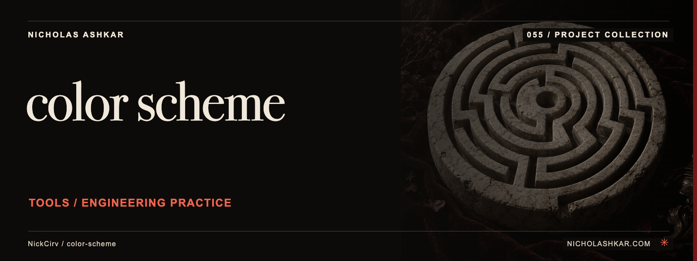

# color-scheme

Extracts and transforms source color values and generates palette exports.


<a id="usage"></a>

<a id="extract-all-colors-from-a-stylesheet"></a>

<a id="convert-a-color-between-formats"></a>

<a id="check-wcag-21-contrast-ratio"></a>

<a id="generate-a-harmonious-palette"></a>

<a id="preview-a-color-as-an-ansi-swatch"></a>

## What it does

- Source-color extraction.
- Conversions and previews.
- Palette generation.
- Contrast, lint and export commands.


<a id="install"></a>

## Quickstart

Prerequisites: Node.js `>=20` and npm. The checkout below pins the source used for this documentation.

```sh
git clone https://github.com/NickCirv/color-scheme.git
cd color-scheme
git checkout 2220cbaca13b55e54a773f0a81c7a4fda76f01f7
node index.js convert "#f2644e" --to rgb
```

**Expected behavior (illustrative, not captured):** Prints conversions for the supplied color.

Examples are source-inspected, **not runtime-tested**. See the research record for verification gaps.

## Boundaries and data

Source extraction uses text patterns and can miss dynamic values or context. Pairwise contrast is only one accessibility check; palette linting is not a full design audit.

## Development

The manifest defines `npm test` as:

```sh
node --test
```

The captured suite is a smoke check, not end-to-end behavior coverage. Examples include “entry is valid JavaScript”. Tests were not run for this documentation revision.

See [implementation and command reference](docs/REFERENCE.md) for the package scripts and inspected interfaces, and [research record](docs/RESEARCH.md) for the pinned source, document decisions and unresolved checks.

## License and contact

See [LICENSE](LICENSE) for the original terms and attribution. Legal text is unchanged.

[Nicholas Ashkar](https://nicholashkar.com/) · [Discuss a project](https://nicholashkar.com/#oxblood-contact)
